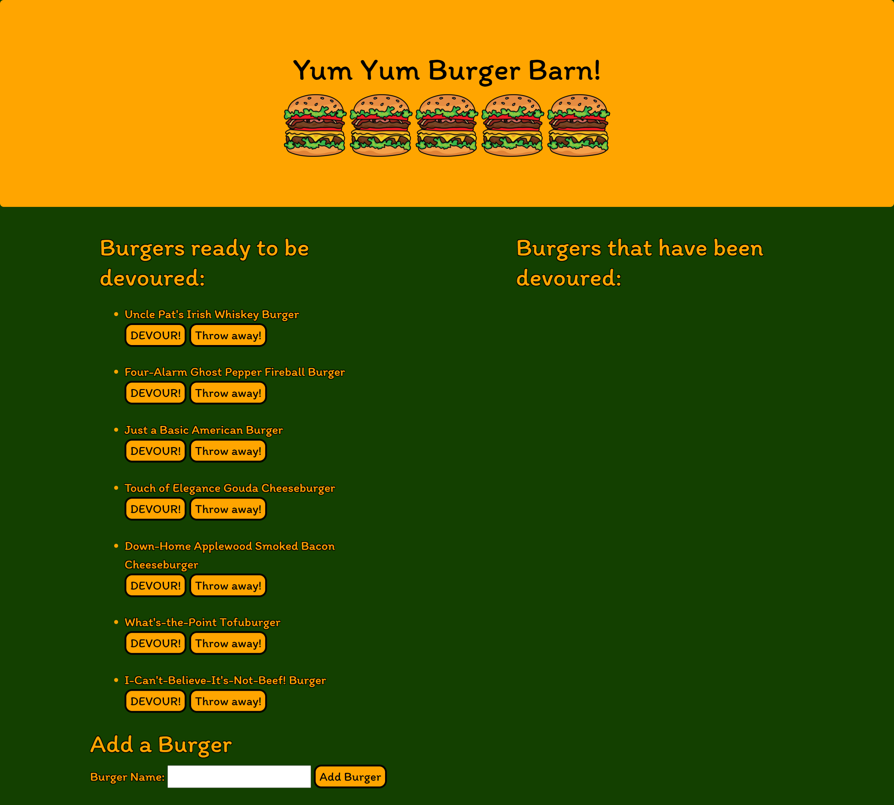
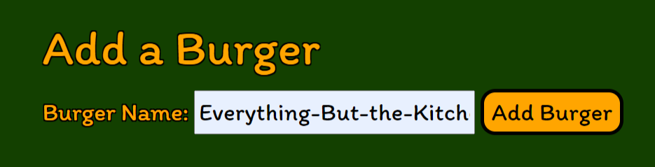

# Yum Yum Burger Logger

## Table of Contents

* [Description](#description)
* [Links](#links)
* [Screenshots](#screenshots)
* [Installation](#installation)
* [Technologies Used](#technologies)
* [Tests](#tests)
* [Credits](#credits)
* [Contributing](#contributing)
* [Questions](#questions)
* [License](#license)

## Description

This app allows the user to move a burger from the "undevoured" section on the left to the "devoured" section on the right, delete a burger, and add a new burger, all by clicking the appropriate button.

## Links

[Deployed application on Heroku](https://floating-lake-94290.herokuapp.com/)

## Screenshots

Landing page:

Page with undevoured burgers on the left and devoured burgers on the right:

Add Burger form:

## Installation Instructions

npm i

## Technologies Used

Node.js, Express, Express Handlebars, MySQL

## Tests

npm run test

## Credits

N/A

## Contributing

N/A

## Questions

If you have further questions, you can reach me at lauracole1900@comcast.net. For more of my work, see [my GitHub](https://github.com/LauraCole1900).

## License

.