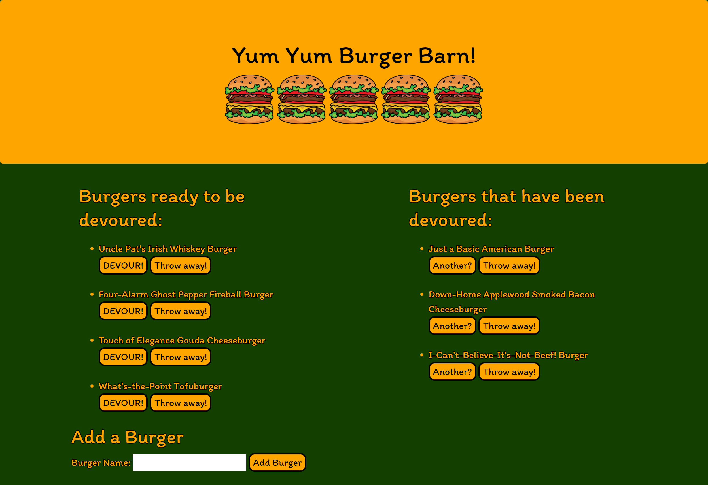

# Yum Yum Burger Logger

## Table of Contents

* [Description](#description)
* [Links](#links)
* [Screenshots](#screenshots)
* [Installation](#installation)
* [Technologies Used](#technologies)
* [Tests](#tests)
* [Credits](#credits)
* [Contributing](#contributing)
* [Questions](#questions)
* [License](#license)

## Description

This app allows the user to move a burger from the "undevoured" section on the left to the "devoured" section on the right, delete a burger, and add a new burger, all by clicking the appropriate button.

## Links

[Deployed application on Heroku](https://floating-lake-94290.herokuapp.com/)

## Screenshots

Landing page:


Page with undevoured burgers on the left and devoured burgers on the right:


Add Burger form:


## Installation Instructions

If you want to run a copy of this app on your local machine, first clone the repository:

HTTPS:
```
$ git clone https://github.com/LauraCole1900/expressNoteTaker.git
```

SSH:
```
$ git clone git@github.com:LauraCole1900/expressNoteTaker.git
```

Then cd into the cloned directory and download the dependencies by typing into the command line
```
$ npm install --save
```

You will also need to download MySQL Workbench from the MySQL website here:
```
https://dev.mysql.com/downloads/mysql/
```

You will need to configure MySQL Workbench before using it. Instructions can be found here:
```
https://dev.mysql.com/doc/workbench/en/wb-mysql-connections.html
```

Once the dependencies and MySQL Workbench are installed and MySQL Workbench is configured, start the application by typing into the command line
```
$ node server.js
```

Then go to the browser and enter into the address bar
```
$ localhost:3005
```

## Technologies Used

Node.js, Express, Express Handlebars, MySQL

## Tests

npm run test

## Credits

N/A

## Contributing

N/A

## Questions

If you have further questions, you can reach me at lauracole1900@comcast.net. For more of my work, see [my GitHub](https://github.com/LauraCole1900).

## License

.